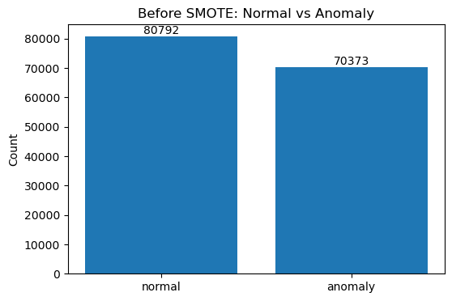
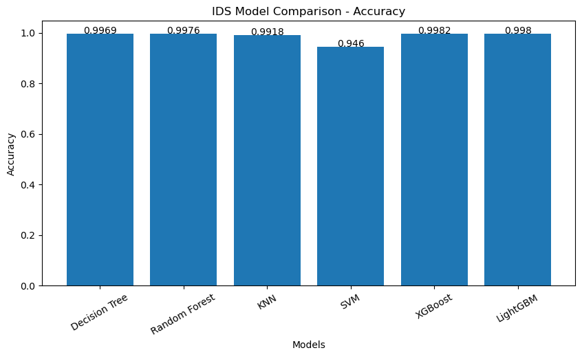
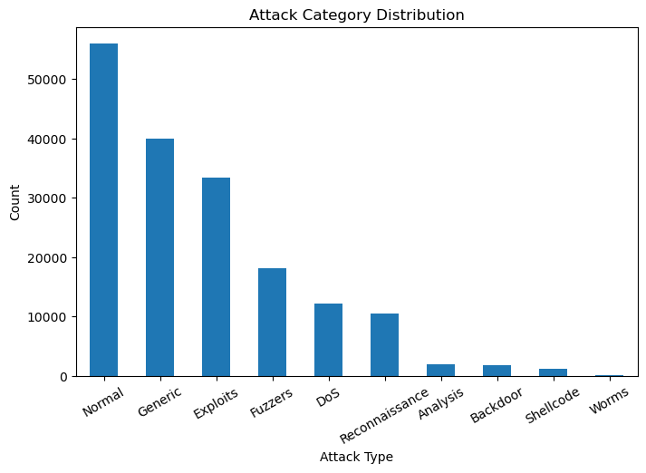
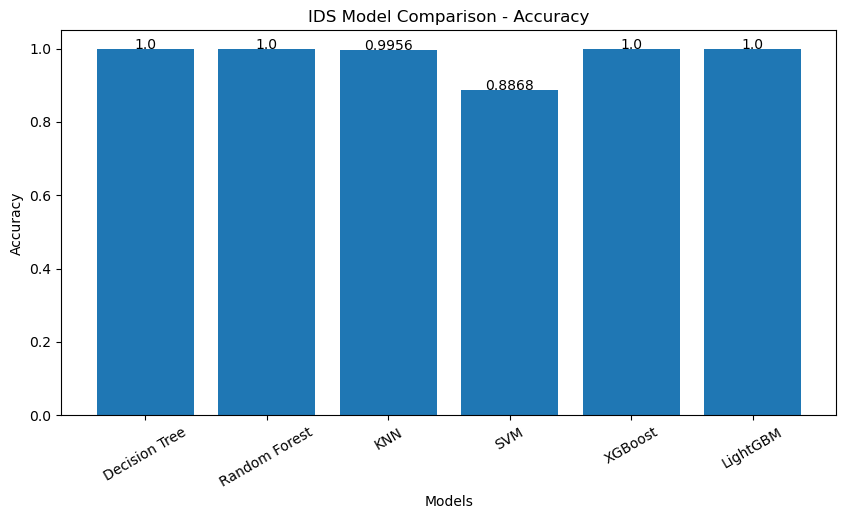

# EBBA-Based Intrusion Detection System (EBBA-IDS)

# 🎓 Final Year College Project

This project is developed as a **Final Year College Project** focused on an EBBA-based Intrusion Detection System using the NSL-KDD and UNSW-NB15 datasets.

---

## 👥 Project Team

### Project Lead
- **Shweta Kumari**

### Co-Lead
- **Mandeep Kumar**

---


An Intrusion Detection System (IDS) project using **EBBA (Enhanced Binary Bat Algorithm)** for feature selection and machine-learning classifiers for network intrusion detection.

The project evaluates the approach on two benchmark cybersecurity datasets:

- **NSL-KDD**
- **UNSW-NB15**

The original notebook-based workflow has been improved without changing the overall project structure. The improvements focus on experimental correctness, reproducibility, EBBA evaluation, model comparison, visualization, and analysis.

---

## 📌 Project Overview

The project follows this workflow:

```text
Dataset
   ↓
Data Cleaning & Exploration
   ↓
Feature Encoding
   ↓
Train/Test Split
   ↓
Feature Scaling
   ↓
Baseline Machine Learning Models
   ↓
Baseline Evaluation
   ↓
SMOTE-ENN on Training Data
   ↓
EBBA Feature Selection
   ↓
EBBA Validation-Based Fitness
   ↓
Selected Features
   ↓
Machine Learning Models with EBBA Features
   ↓
After-EBBA Evaluation
   ↓
Before vs After Comparison
   ↓
Confusion Matrix / ROC-AUC / F1 / Classification Report
   ↓
Feature Importance & EBBA Convergence
```

---

# 📂 Notebooks

## 1. NSL-KDD

Notebook:

```text
NSL-KDD_EBBA_Improved.ipynb
```

The NSL-KDD notebook performs binary intrusion detection:

- `normal`
- `anomaly`

It includes:

- Dataset exploration
- Data preprocessing
- Encoding
- Train/test split
- Scaling
- Baseline model evaluation
- SMOTE-ENN
- EBBA feature selection
- EBBA convergence analysis
- Feature reduction analysis
- Post-EBBA model evaluation
- Confusion matrices
- ROC-AUC
- Classification reports
- Feature importance
- Cross-validation
- Before/after EBBA comparison

---

## 2. UNSW-NB15

Notebook:

```text
UNSW-NB15_EBBA_Improved.ipynb
```

The UNSW-NB15 notebook performs binary intrusion detection:

```text
0 → Normal
1 → Attack
```

For the binary classification experiment, `attack_cat` is excluded from the ML input features because it describes the attack category associated with the target.

The notebook includes the same major evaluation stages as the NSL-KDD notebook.

---

# 🤖 Machine Learning Models

The notebooks compare the following models:

| Model | Purpose |
|---|---|
| Decision Tree | Tree-based classification |
| Random Forest | Ensemble tree classification |
| KNN | Distance-based classification |
| Linear SVM | Linear classification |
| XGBoost | Gradient boosting |
| LightGBM | Gradient boosting |

The models are evaluated both:

```text
Before EBBA
```

and

```text
After EBBA
```

EBBA is used as a **feature-selection algorithm**, not as an additional classifier.

---

# 🦇 EBBA Feature Selection

EBBA searches for a subset of useful features.

Each candidate solution represents a binary feature mask:

```text
1 → feature selected
0 → feature not selected
```

The improved configuration uses:

```text
Bats       = 15
Iterations = 20
Random Seed = 42
```

The fitness function combines:

```text
Validation Accuracy
        -
Feature Selection Penalty
```

The important change is that EBBA fitness is evaluated on a separate validation set rather than measuring the Decision Tree on the exact data used to train it.

---

# ⚖️ Class Imbalance Handling

The notebooks use **SMOTE-ENN** on the training/resampled data.

The test set remains separate from the resampling stage.

This helps avoid allowing test data to influence the training/resampling process.

---

# 📊 Evaluation Metrics

The project reports:

- Accuracy
- Precision
- Recall
- Weighted F1 Score
- ROC-AUC
- Training time
- Prediction time
- Confusion matrix
- Classification report

The project also includes:

- EBBA convergence curve
- Feature reduction visualization
- Random Forest feature importance
- Before vs After EBBA comparison
- 5-fold stratified cross-validation

---

# 📈 EBBA Convergence

The improved notebooks record the best EBBA fitness after every iteration.

This makes it possible to visualize whether the search improves over iterations.

```text
Iteration → Best Fitness
```

The convergence graph is generated directly from the notebook.

---

# 🔍 Feature Reduction

The project compares:

```text
Original Features
        ↓
       EBBA
        ↓
Selected Features
```

The notebook reports:

- Total original features
- Total selected features
- Percentage of feature reduction

---

# 🌲 Feature Importance

After EBBA selects the feature subset, a Random Forest is used to calculate feature importance among the selected features.

The notebook displays the most important selected features.

This provides an additional interpretation of the selected feature subset.

---

# 🔬 Cross-Validation

A 5-fold `StratifiedKFold` evaluation is included using:

```text
5 folds
shuffle = True
random_state = 42
```

The reported values include:

- Mean weighted F1
- Standard deviation of weighted F1

---

# 📋 Before vs After EBBA

The final analysis compares the same ML models before and after EBBA.

The comparison includes:

| Metric |
|---|
| Accuracy |
| Precision |
| Recall |
| F1 Score |
| ROC-AUC |
| Training Time |
| Prediction Time |

This allows the effect of feature selection to be examined without presenting EBBA itself as a separate classifier.

---

# 🛠️ Technologies Used

- Python
- Jupyter Notebook
- Pandas
- NumPy
- Matplotlib
- Seaborn
- Scikit-learn
- Imbalanced-learn
- XGBoost
- LightGBM

---

# 📦 Installation

Install the required Python packages:

```bash
pip install pandas numpy matplotlib seaborn scikit-learn imbalanced-learn xgboost lightgbm jupyter
```

Then start Jupyter:

```bash
jupyter notebook
```

Open the required notebook and execute the cells from top to bottom.

---

# 📁 Dataset Files

Place the datasets in the same working directory as the notebooks, or update the CSV paths in the first data-loading cells.

Expected dataset names used by the notebooks include:

```text
NSL-KDD.csv
UNSW_NB15_training-set.csv
```

---

# ▶️ How to Run

## NSL-KDD

1. Place `NSL-KDD.csv` in the expected directory.
2. Open `NSL-KDD_EBBA_Improved.ipynb`.
3. Run the cells from top to bottom.
4. Review the baseline model results.
5. Review EBBA convergence.
6. Review selected features.
7. Review post-EBBA model results.
8. Review the Before vs After EBBA comparison.

## UNSW-NB15

1. Place `UNSW_NB15_training-set.csv` in the expected directory.
2. Open `UNSW-NB15_EBBA_Improved.ipynb`.
3. Run the cells from top to bottom.
4. Review the same evaluation stages.

---

# 📸 Previous Notebook Visualizations

The repository package includes the visualization images produced by the **original notebooks** under:

```text
README_images/
```

These are retained as historical/reference images from the previous notebook version.

> **Important:** The improved notebooks change the EBBA fitness evaluation, search configuration, UNSW feature handling, and evaluation workflow. Therefore, the previous metric/result images should **not** be treated as the final output of the improved notebooks. Re-run the improved notebooks to generate the new final results.

Selected previous visualizations:

### NSL-KDD





### UNSW-NB15





---

# 📌 Important Experimental Notes

### EBBA is a feature selector

The proposed workflow is:

```text
Dataset
   ↓
SMOTE-ENN
   ↓
EBBA
   ↓
Selected Features
   ↓
ML Classifiers
```

EBBA should therefore not be reported as an additional ML classifier.

### Test data remains separate

The final model evaluation uses the held-out test set.

### Reproducibility

The improved notebooks use:

```python
random_state = 42
```

where applicable.

### Output values

Because the improved notebooks contain methodological changes, the numerical outputs may differ from the original notebook outputs. The previous images are included only as historical/reference images.

---

# 🚀 Future Improvements

Possible future extensions include:

- Hyperparameter optimization
- More extensive EBBA parameter studies
- Additional IDS datasets
- Multiclass UNSW-NB15 classification
- Precision-Recall curves
- ROC curves
- Statistical significance testing
- Multiple independent EBBA runs
- Real-time network traffic prediction
- Model persistence and deployment

---

# 👨‍💻 Project Structure

```text
EBBA-IDS/
│
├── NSL-KDD_EBBA_Improved.ipynb
├── UNSW-NB15_EBBA_Improved.ipynb
├── NSL-KDD.csv
├── UNSW_NB15_training-set.csv
├── README.md
│
└── README_images/
    ├── NSL_KDD_*.png
    └── UNSW_NB15_*.png
```

---

# 📄 Project Summary

This project investigates an EBBA-based feature-selection workflow for intrusion detection using NSL-KDD and UNSW-NB15 datasets.

The improved implementation emphasizes:

```text
Reproducibility
      +
Correct validation
      +
Feature selection
      +
Class imbalance handling
      +
Multiple ML classifiers
      +
Comprehensive evaluation
```

The final experimental results should be generated by running the improved notebooks rather than copying the numerical results from the original notebook version.
